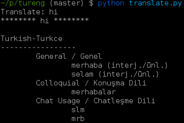

# tureng

A very early tureng.com implementation written in Python.

## About the tureng.com API

I just stole it, lol. I sniffed http traffics of tureng android app and after that, i decompiled apk of tureng andriod app for seeing how "Code" parameter is generating. NO REGRET. I DIDN'T CHOOSE THUG LIFE, THUG LIFE CHOSE ME.

